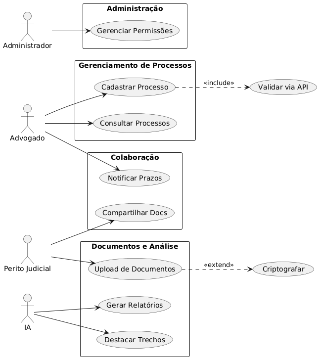

# Projeto Disciplina: Requisitos de Software

Olá! Este repositório faz parte do projeto da disciplina de Requisitos de Software da UTFPR - Campus Cornélio Procópio.

Link do Padlet: [Evidence](https://padlet.com/kawanharshe/evidence-i6j1q27zigdgo0ue)

## 1. Introdução

### 1.1. Nome do Grupo

DevCaverna

**Integrantes:**

- [@KawanKakubo](https://github.com/KawanKakubo) — Kawan Harshe Kakubo
- [@OtavioGonzaga](https://github.com/OtavioGonzaga) — Otavio Luiz Gonzaga
- [@reimuh](https://github.com/reimuh) — André Born
- [@tavinhoo](https://github.com/tavinhoo) — Otávio
- [@Vinicius-Antonio](https://github.com/Vinicius-Antonio) — Vinicius Antonio

***1.2. Nome do Sistema***

Evidence

***1.3. Propósito do Sistema***

Este documento apresenta os requisitos dos usuários a serem desenvolvidos pela Evidence, fornecendo aos desenvolvedores as informações necessárias para o projeto e implementação, assim como para a realização dos testes e homologação do sistema.

O objetivo do sistema Evidence é auxiliar advogados e peritos judiciais por meio do cadastro de informações sobre processos jurídicos e do upload de documentos, possibilitando que uma inteligência artificial gere relatórios e insights sobre os casos. O sistema ajudará a otimizar o tempo dos profissionais, aumentar a precisão das análises e garantir melhores resultados em processos judiciais.

***1.4. Público-Alvo***

Este documento se destina aos arquitetos de software, engenheiros de software, testadores, clientes e demais profissionais envolvidos no desenvolvimento do sistema Evidence.

***1.5. Descrição dos Usuários***

O sistema Evidence será utilizado por advogados, peritos judiciais e demais profissionais da área jurídica.

***Personas:***
[Personas](https://www.canva.com/design/DAGmocIOSE4/01dDA-jb2goppFgMoq1PmA/edit?utm_content=DAGmocIOSE4&utm_campaign=designshare&utm_medium=link2&utm_source=sharebutton)

***Análise da situação atual: antes da introdução de sua solução***

- **O que as pessoas fazem?**
  Analisam manualmente documentos e dados jurídicos, o que pode ser demorado e sujeito a erros.

- **Quais os artefatos envolvidos?**
  Papéis físicos, documentos digitais não organizados, processos judiciais diversos.

- **O que elas precisam saber?**
  Entender o andamento de processos, identificar padrões, reunir informações relevantes.

***Análise das tarefas depois: como serão executadas as suas tarefas com sua solução***

- **O que as pessoas fazem?**
  Cadastram casos e documentos no sistema e analisam relatórios automáticos gerados pela IA.

- **Quais os artefatos envolvidos?**
  Sistema Evidence, documentos digitais organizados e processados.

- **O que elas precisam saber?**
  Como interpretar os insights e relatórios gerados automaticamente pelo sistema.

***Cenário: Antes***

Os profissionais jurídicos gastam horas analisando documentos e processos, frequentemente lidando com informações dispersas e sem auxílio de tecnologias inteligentes.

***Cenário: Depois***

Com o Evidence, os profissionais cadastram os dados no sistema e, em poucos minutos, recebem relatórios e insights baseados em IA, otimizando tempo e aumentando a precisão de suas decisões jurídicas.

## 2. Documentos gerais no repositório

***2.1. Requisitos Funcionais***

| Identificador | Descrição                                                                                                                                                        | Prioridade               |
| ------------- | ---------------------------------------------------------------------------------------------------------------------------------------------------------------- | ------------------------ |
| **RF01**      | O sistema deve permitir que o advogado cadastre informações básicas de um processo jurídico, incluindo número do processo, partes envolvidas e data de abertura. | **Must**                 |
| **RF02**      | O sistema deve permitir que o perito judicial faça upload de documentos relacionados a um processo em formatos como PDF, DOCX e JPEG.                            | **Must**                 |
| **RF03**      | O sistema deve permitir que o advogado consulte todos os processos cadastrados, filtrando por status ativo, arquivado e concluído.                               | **Must**                 |
| **RF04**      | O sistema deve gerar relatórios automáticos sobre padrões em processos jurídicos, como tempo médio de resolução e tendências de decisões.                        | **Should**               |
| **RF05**      | O sistema deve enviar notificações para o advogado quando prazos processuais estiverem próximos de vencer.                                                       | **Should**               |
| **RF06**      | O sistema deve permitir que o advogado adicione anotações personalizadas a um processo, como observações sobre estratégias ou contatos relevantes.               | **Could**                |
| **RF07**      | O sistema deve permitir que o perito judicial compartilhe documentos específicos com outros profissionais vinculados ao mesmo processo.                          | **Could**                |
| **RF08**      | O sistema deve garantir que a inteligência artificial analise documentos jurídicos e destaque trechos relevantes.                                                | **Won’t**                |
| **RF09**      | O sistema deve permitir que o administrador gerencie permissões de acesso.                                                                                       | **Must**                 |
| **RF10**      | O sistema deve permitir que o advogado leia e aprove as ações dos estagiários.                                                                                   | **Should**               |

***2.2. Requisitos Não Funcionais***

| Identificador | Descrição                                                                                                                                                                                           | Depende de             | Prioridade               |
| ------------- | --------------------------------------------------------------------------------------------------------------------------------------------------------------------------------------------------- | ---------------------- | ------------------------ |
| **RNF01**     | O sistema deve integrar-se com APIs governamentais para validação e atualização automática de dados processuais.                                                                                    | RF01, RF03             | **Should**               |
| **RNF02**     | O sistema deve utilizar um banco de dados não relacional (NoSQL) para armazenar documentos, anotações e metadados de forma escalável.                                                               | RF02, RF06, RF08       | **Must**                 |
| **RNF03**     | O sistema deve ser implementado com suporte à concorrência e alta performance, utilizando a linguagem Go para otimizar tarefas paralelas, como geração de relatórios e processamento de documentos. | RF02, RF04, RF05, RF08 | **Could**                |
| **RNF04**     | O sistema deve garantir alta disponibilidade (99,9%) para que os usuários possam acessá-lo a qualquer momento, especialmente em prazos críticos.                                                    | RF05, RF03             | **Must**                 |
| **RNF05**     | As notificações de prazos devem ser entregues com latência inferior a 5 minutos, via e-mail e/ou push notification.                                                                                 | RF05                   | **Should**               |
| **RNF06**     | O sistema deve permitir anotações com suporte a texto negrito, listas, links e salvamento automático a cada 30 segundos.                                                                            | RF06                   | **Could**                |
| **RNF07**     | O compartilhamento de documentos entre profissionais deve respeitar permissões e criptografia ponta a ponta.                                                                                        | RF07, RF09, RF10       | **Must**                 |
| **RNF08**     | A análise com inteligência artificial deve processar documentos com tempo de resposta inferior a 10 segundos por arquivo e exibir trechos destacados com precisão baseada em NLP jurídico.          | RF08                   | **Won’t**                |
| **RNF09**     | O sistema deve oferecer um painel de controle para o administrador gerenciar permissões de forma granular, com logs de acesso e histórico de alterações.                                            | RF09                   | **Must**                 |
| **RNF10**     | Os relatórios exportados devem seguir padrões visuais consistentes como layout, cores, logotipo e estar disponíveis nos formatos PDF e DOCX.                                                        | RF04                   | **Should**               |

***2.3. Perguntas***

Em que período da faculdade você está atualmente?

Já participou de estágios, núcleos de prática jurídica ou teve contato com casos reais?

Quais são suas maiores dificuldades ao analisar processos ou documentos jurídicos?

Você sente que perde muito tempo tentando identificar as informações importantes em um processo?

Você utiliza alguma ferramenta digital para estudar ou organizar documentos jurídicos? Quais?

Já usou ou ouviu falar em inteligência artificial aplicada ao Direito? O que acha disso?

Você usaria um sistema que analisa automaticamente processos e destaca as partes mais relevantes?

Que tipo de informação esse sistema deveria destacar para ser realmente útil para você?

O que faria você confiar em uma ferramenta jurídica com inteligência artificial?

Você teria alguma preocupação ética ou legal em usar IA para lidar com processos judiciais?

Como você organizaria um workspace envolvendo toda a sua equipe com a análise dos casos?

Você tem dificuldades em encontrar informações em um conjunto extenso de documentações?

Para você, o que é mais importante para organizar um caso?

Nas principais áreas de direito em que você atua, quais as principais informações para os casos, em cada uma delas?

Qual padrão você mais identifica, que mais se repete, nos casos em que trabalha?

Quais informações devem ser imprescindivelmente ocultadas nos casos, considerando que as informações serão armazenadas pela IA?

***2.4. Entrevista***

[📄 Ver Entrevista no Google Drive](https://drive.google.com/file/d/1KwKKZjJkQJ_0BJBbh0l0El9qQsv6_5AH/view)

***2.5. Histórias do Usuário***

| História de Usuário | Objetivo |
|---------------------|----------|
| Como advogado, quero cadastrar informações básicas de um processo jurídico para que eu possa iniciar o acompanhamento do caso no sistema. | Iniciar o acompanhamento de processos. |
| Como advogado, quero fazer upload de documentos relacionados a um processo nos formatos aceitos, para que os envolvidos tenham acesso à documentação necessária. | Garantir o acesso à documentação do processo. |
| Como advogado, quero consultar todos os processos cadastrados com filtros por status, para que eu possa localizar rapidamente os casos conforme a situação atual. | Localizar casos com agilidade. |
| Como advogado, quero relatórios automáticos com padrões em processos jurídicos, para que eu possa tomar decisões estratégicas. | Apoiar a tomada de decisões estratégicas. |
| Como advogado, quero receber notificações quando prazos processuais estiverem próximos de vencer, para que eu não perca nenhum prazo importante. | Evitar perda de prazos processuais. |
| Como advogado, quero adicionar anotações personalizadas a um processo, para que eu possa registrar estratégias ou informações relevantes. | Registrar informações e estratégias no processo. |
| Como perito judicial, quero compartilhar documentos específicos com outros profissionais do mesmo processo, para que possamos colaborar de forma eficiente. | Facilitar a colaboração entre profissionais. |
| Como advogado, quero que a inteligência artificial analise documentos jurídicos e destaque trechos relevantes, para que eu ganhe tempo na leitura e análise. | Economizar tempo com análise de documentos. |
| Como administrador, quero gerenciar as permissões de acesso dos usuários, para que apenas pessoas autorizadas possam acessar determinadas funcionalidades. | Garantir segurança e controle de acesso. |
| Como advogado, quero ler e aprovar ações realizadas por estagiários, para que eu tenha controle e segurança sobre o trabalho. | Controlar e supervisionar ações de estagiários. |
| Como advogado, quero que o sistema esteja disponível 99,9% do tempo, para que eu possa acessá-lo mesmo em prazos críticos. | Ter acesso confiável ao sistema. |
| Como administrador, quero gerenciar permissões e acessar históricos de ações, para que eu tenha controle e rastreabilidade sobre o uso do sistema. | Manter rastreabilidade e segurança no uso do sistema. |
| Como advogado, quero receber notificações de prazos em até 5 minutos, para que possa reagir rapidamente a eventos importantes. | Reagir com agilidade a eventos urgentes. |

***2.6. Diagramas de Caso de Uso e Especificações***

***2.7. Diagramas de Atividades***

***2.8. Matrizes de Rastreabilidade***

| ID Req  | Descrição do Requisito                                                                                                   | ID Teste  | Descrição do Teste                                                         | Status do Teste  |
|---------|--------------------------------------------------------------------------------------------------------------------------|-----------|----------------------------------------------------------------------------|------------------|
| RF01    | Cadastro de informações básicas de um processo jurídico                                                                  | TEST-001  | Verificar se é possível cadastrar número, partes e data de abertura        | Passou           |
| RF02    | Upload de documentos (PDF, DOCX, JPEG) pelo perito judicial                                                              | TEST-002  | Verificar se os arquivos são aceitos e salvos corretamente                 | Passou           |
| RF03    | Consulta de processos com filtros (ativo, arquivado, concluído)                                                          | TEST-003  | Validar funcionalidade de filtro e exibição de lista                       | Passou           |
| RF04    | Geração de relatórios automáticos com padrões jurídicos                                                                  | TEST-004  | Validar criação e conteúdo dos relatórios automáticos                      | Passou           |
| RF05    | Notificações de prazos processuais próximos                                                                              | TEST-005  | Verificar recebimento de notificações em casos com prazo próximo           | Passou           |
| RF06    | Adição de anotações personalizadas                                                                                       | TEST-006  | Inserir anotações e verificar salvamento                                   | Passou           |
| RF07    | Compartilhamento de documentos entre profissionais                                                                       | TEST-007  | Compartilhar documento e validar permissões                                | Passou           |
| RF08    | IA analisa documentos e destaca trechos relevantes                                                                       | TEST-008  | Verificar se a IA identifica corretamente os trechos importantes           | Não testado      |
| RF09    | Gerenciamento de permissões de acesso pelo administrador                                                                 | TEST-009  | Criar usuários com permissões diferentes e verificar controle de acesso    | Passou           |
| RF10    | Leitura e aprovação de ações de estagiários pelo advogado                                                                | TEST-010  | Validar aprovação de ações realizadas por perfil estagiário                | Passou           |
| RNF01   | Integração com APIs governamentais                                                                                       | TEST-011  | Simular retorno de API externa e validar atualização de dados              | Passou           |
| RNF02   | Uso de banco de dados NoSQL para documentos e anotações                                                                  | TEST-012  | Verificar persistência e consulta em banco NoSQL                           | Passou           |
| RNF03   | Implementação com concorrência e alta performance com Go                                                                 | TEST-013  | Medir desempenho e paralelismo em tarefas pesadas                          | Parcialmente     |
| RNF04   | Alta disponibilidade (99,9%)                                                                                             | TEST-014  | Simular múltiplos acessos e validar uptime                                 | Em execução      |
| RNF05   | Notificações entregues com latência inferior a 5 minutos                                                                 | TEST-015  | Cronometrar tempo entre evento e notificação recebida                      | Passou           |
| RNF06   | Anotações com negrito, listas, links e salvamento automático                                                             | TEST-016  | Testar formatação e autosave a cada 30s                                    | Passou           |
| RNF07   | Compartilhamento com criptografia ponta a ponta e respeito às permissões                                                 | TEST-017  | Testar se usuários não autorizados conseguem visualizar documentos         | Passou           |
| RNF08   | IA deve processar arquivo em menos de 10s e destacar trechos com NLP jurídico                                            | TEST-018  | Medir tempo de resposta e qualidade do destaque da IA                      | Não testado      |
| RNF09   | Painel de controle com logs de acesso e histórico de alterações                                                          | TEST-019  | Validar acesso aos logs e exibição de alterações                           | Passou           |
| RNF10   | Exportação de relatórios com layout, logotipo, e formatos PDF/DOCX                                                       | TEST-020  | Testar exportação em ambos formatos com layout correto                     | Passou           |

Obs.:

- Os testes TEST-008 e TEST-018 foram marcados como “Não testado” pois dependem da IA ainda não implementada ou testada.
- O requisito RNF03 teve resultado parcial, considerando limitações práticas de simulação de concorrência.

***2.9. Protótipos***

[Protótipo das telas](https://ninjamock.com/s/MCXF7Lx)

## Estudo de Viabilidade

**Viabilidade Operacional:**
O projeto é viável considerando a disponibilidade de tecnologias de inteligência artificial para análise de texto jurídico e plataformas de desenvolvimento de sistemas. Há também uma necessidade real de otimização de processos jurídicos, o que garante adesão do público-alvo.

**Viabilidade Técnica:**
Quanto a viabilidade técnica, todos os aspectos são simples, com exceção da IA e do algoritmo de censura de dados sensíveis.
Para a IA, será utilizado um serviço de terceiros (OpenAI, Cloude, etc.), e o algoritmo pode ser importado de bibliotecas abertas para garantir viabilidade e segurança.

**Cronograma:**

- Levantamento de Requisitos: 2 semanas
- Análise e Modelagem: 2 semanas
- Desenvolvimento Inicial: 4 semanas
- Testes e Validações: 2 semanas
- Ajustes Finais e Deploy: 2 semanas

Total: Aproximadamente 3 meses.

## Objetivos de Desenvolvimento Sustentável (ODS)

Este projeto atende ao ODS 16 da ONU: Paz, Justiça e Instituições Eficazes, promovendo igualdade de acesso à justiça por meio de um sistema que gera decisões mais rápidas e justas com auxílio da tecnologia.

## Referências
